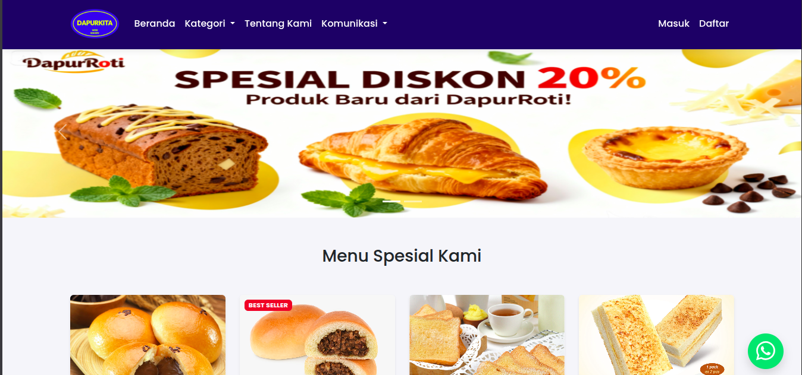
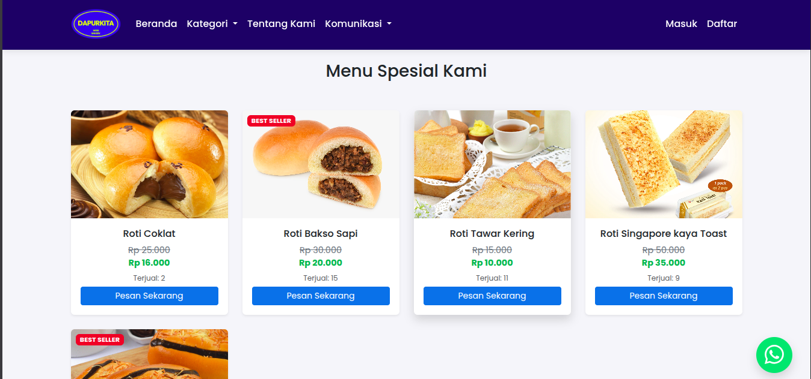
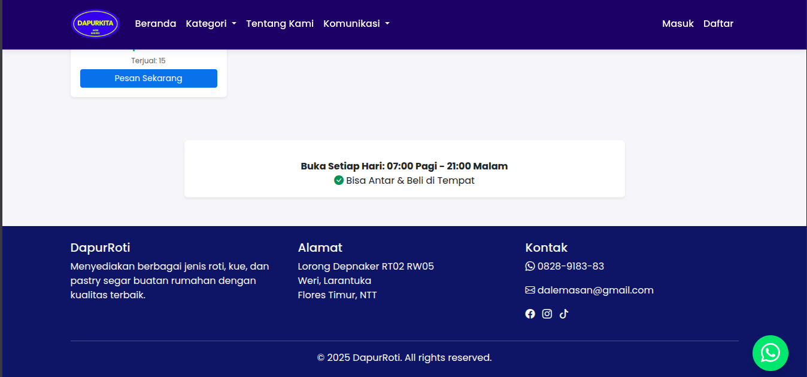
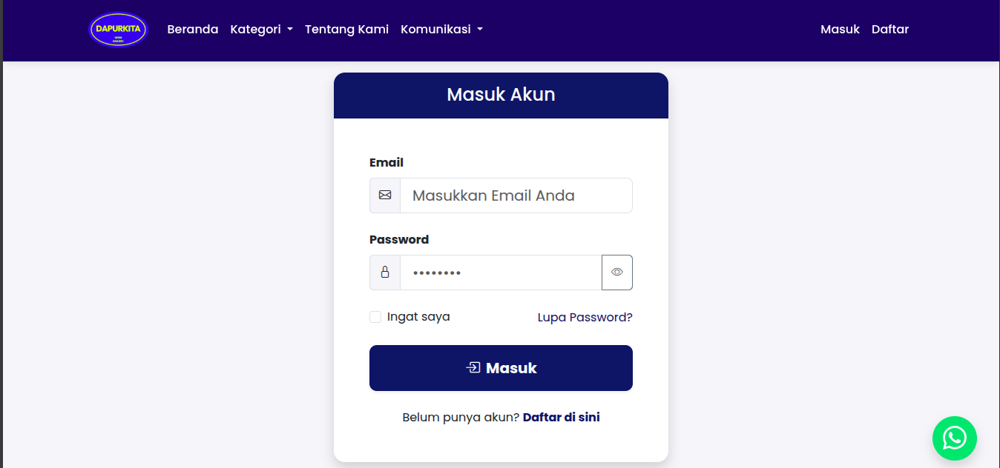
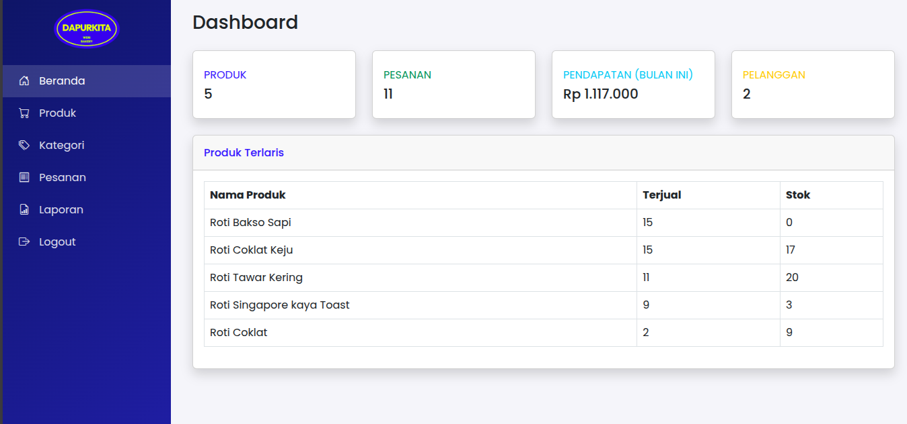
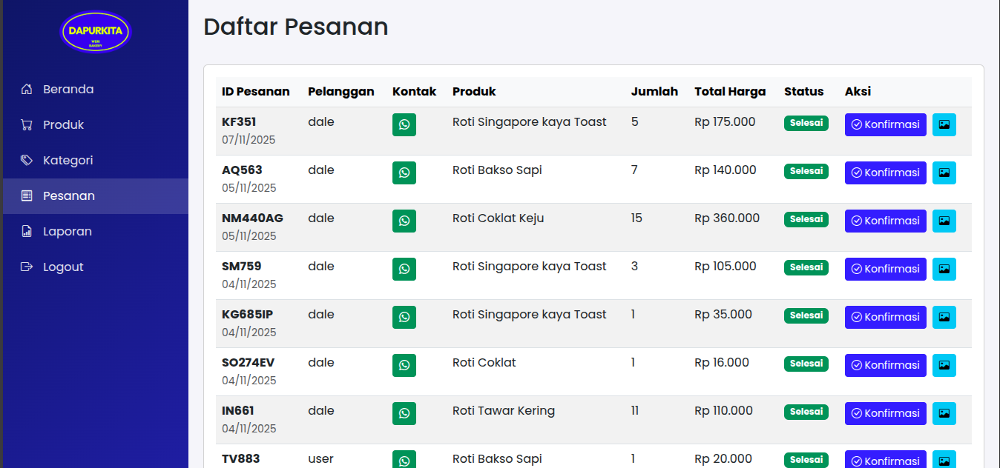
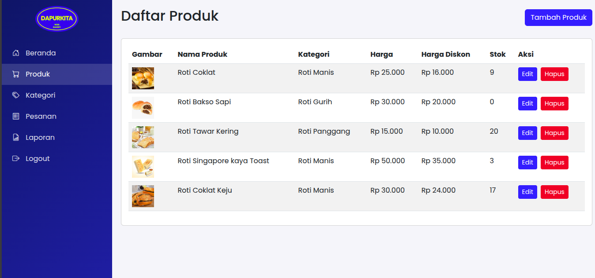
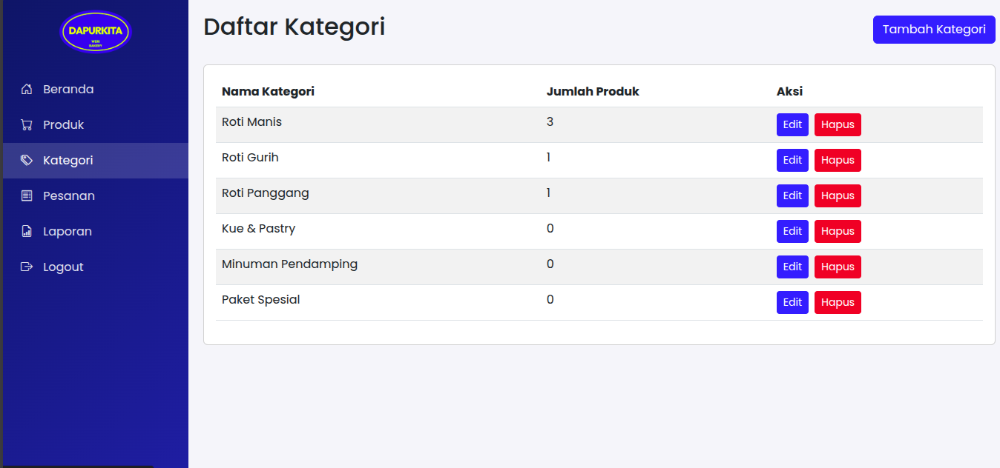
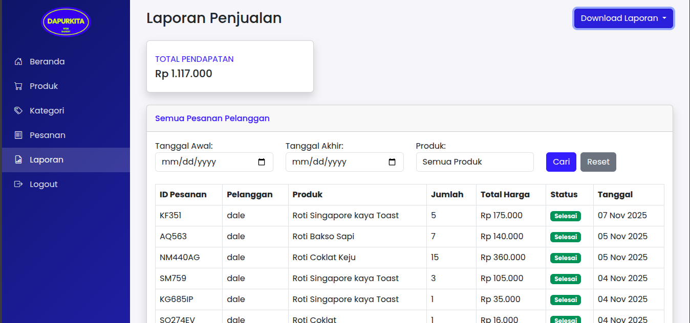

# 🥐 Dapur Roti - Aplikasi E-Commerce Toko Roti

<p align="center">
  
  
  
  
</p>

---

## 📖 Daftar Isi

- [Tentang Aplikasi](#-tentang-aplikasi)
- [Galeri Screenshot](#-galeri-screenshot)
- [Fitur Utama](#-fitur-utama)
- [Teknologi](#-teknologi)
- [Struktur Database](#-struktur-database)
- [Cara Instalasi](#-cara-instalasi)
- [Cara Menjalankan](#-cara-menjalankan)
- [Akun Default](#-akun-default)
- [Struktur Folder](#-struktur-folder)
- [API Documentation](#-api-documentation)
- [Lisensi](#-lisensi)

---

## 📸 Galeri Screenshot

### 🌐 Public Pages

#### Homepage


#### Produk


#### Kategori


#### Login


### 🔐 Admin Panel

#### Dashboard Admin


#### Manajemen Pesanan


#### Tambah Produk


#### Tambah Kategori


#### Laporan


---

## 🏪 Tentang Aplikasi

**Dapur Roti** adalah aplikasi e-commerce berbasis web yang dirancang khusus untuk toko roti. Aplikasi ini menyediakan platform lengkap untuk manajemen produk, pemesanan online, dan pelacakan pesanan dengan sistem status yang terintegrasi.

Aplikasi ini memiliki dua jenis pengguna:
- **Pelanggan** - Dapat浏览 produk, melakukan pemesanan, dan melacak status pesanan
- **Admin** - Mengelola produk, kategori, pesanan, dan menghasilkan laporan penjualan

---

## 🎯 Fitur Utama

### 👤 Untuk Pelanggan

| Fitur | Deskripsi |
|-------|-----------|
| 🛍️ **Browse Produk** | Melihat katalog produk roti dengan foto, harga, dan deskripsi lengkap |
| 🏷️ **Filter by Kategori** | Mencari produk berdasarkan kategori (roti, kue, pastry, dll) |
| 📄 **Detail Produk** | Melihat informasi lengkap produk termasuk harga diskon dan stok |
| 📝 **Registrasi & Login** | Sistem autentikasi untuk melakukan pemesanan |
| 🛒 **Checkout** | Proses pemesanan dengan input jumlah dan alamat pengiriman |
| 📤 **Upload Bukti Pembayaran** | Upload foto/file bukti transfer bank |
| 📦 **Riwayat Pesanan** | Melacak status pesanan secara real-time |

### 🔐 Untuk Admin

| Fitur | Deskripsi |
|-------|-----------|
| 📊 **Dashboard** | Statistik penjualan, produk terlaris, total revenue, dan jumlah pelanggan |
| 📦 **Manajemen Produk** | CRUD produk dengan dukungan upload multiple images |
| 🏷️ **Manajemen Kategori** | CRUD kategori produk dengan validasi |
| 📋 **Manajemen Pesanan** | Update status pesanan pelanggan (Menunggu → Diproses → Dikirim → Selesai) |
| 📈 **Laporan Penjualan** | Generate laporan dengan filter tanggal dan produk |
| 📥 **Export Data** | Download laporan dalam format Excel (.xls) atau CSV |

---

## 🛠️ Teknologi

| Kategori | Teknologi | Versi |
|----------|-----------|-------|
| **Framework** | Laravel | 11.x |
| **Bahasa** | PHP | 8.2+ |
| **Frontend** | Blade Templates + Tailwind CSS | 4.x |
| **Database** | SQLite / MySQL | - |
| **Build Tool** | Vite | 7.x |
| **API Documentation** | Dedoc/Scramble | 0.13.x |
| **Testing** | PHPUnit | 10.5+ |
| **Development Tools** | Laravel Sail, Laravel Pint | - |

---

## 📊 Struktur Database

### Diagram Relasi

```
┌─────────────┐       ┌─────────────┐
│   users     │       │ categories  │
├─────────────┤       ├─────────────┤
│ id          │       │ id          │
│ nama        │       │ nama_kategori│
│ email       │       └──────┬──────┘
│ password    │              │
│ no_hp       │              │
│ alamat      │              │
│ role        │              │
└──────┬──────┘              │
       │                      │
       │  ┌───────────────────┘
       │  │
       ▼  ▼
┌─────────────────┐       ┌──────────────────┐
│    products     │       │  product_images  │
├─────────────────┤       ├──────────────────┤
│ id              │◄──────│ product_id       │
│ nama_produk     │       │ image_path       │
│ kategori_id (FK)│       └──────────────────┘
│ harga           │
│ harga_diskon    │
│ stok            │
│ deskripsi       │
│ foto            │
└────────┬────────┘
         │
         │  ┌─────────────────┐
         │  │     orders      │
         ▼  ├─────────────────┤
        ┌───│ id              │
        │   │ custom_order_id │
        │   │ user_id (FK)    │
        │   │ produk_id (FK)  │
        │   │ jumlah          │
        │   │ total_harga     │
        │   │ bukti_pembayaran│
        │   │ status          │
        │   │ alamat_pengiriman│
        │   └─────────────────┘
        │
┌───────▼────────┐
│  Status Enum   │
├────────────────┤
│ Menunggu       │
│ Diproses       │
│ Dikirim        │
│ Selesai        │
│ Dibatalkan      │
└────────────────┘
```

### Tabel Database

#### 1. **users**
| Kolom | Tipe | Keterangan |
|-------|------|------------|
| id | BIGINT | Primary Key |
| nama | VARCHAR | Nama lengkap pengguna |
| email | VARCHAR | Email unik |
| password | VARCHAR | Password (hashed) |
| no_hp | VARCHAR | Nomor telepon |
| alamat | TEXT | Alamat lengkap |
| role | ENUM | 'admin' atau 'user' |

#### 2. **categories**
| Kolom | Tipe | Keterangan |
|-------|------|------------|
| id | BIGINT | Primary Key |
| nama_kategori | VARCHAR | Nama kategori |

#### 3. **products**
| Kolom | Tipe | Keterangan |
|-------|------|------------|
| id | BIGINT | Primary Key |
| nama_produk | VARCHAR | Nama produk |
| kategori_id | BIGINT | Foreign Key → categories |
| harga | INTEGER | Harga normal |
| harga_diskon | INTEGER | Harga diskon (nullable) |
| stok | INTEGER | Stok tersedia |
| deskripsi | TEXT | Deskripsi produk |
| foto | VARCHAR | Path foto utama |

#### 4. **orders**
| Kolom | Tipe | Keterangan |
|-------|------|------------|
| id | BIGINT | Primary Key |
| custom_order_id | VARCHAR | ID pesanan unik (contoh: AB830) |
| user_id | BIGINT | Foreign Key → users |
| produk_id | BIGINT | Foreign Key → products |
| jumlah | INTEGER | Jumlah pesanan |
| total_harga | INTEGER | Total harga |
| bukti_pembayaran | VARCHAR | Path file bukti bayar |
| status | ENUM | Status pesanan |
| alamat_pengiriman | TEXT | Alamat pengiriman |

#### 5. **product_images**
| Kolom | Tipe | Keterangan |
|-------|------|------------|
| id | BIGINT | Primary Key |
| product_id | BIGINT | Foreign Key → products |
| image_path | VARCHAR | Path gambar |

---

## 🚀 Cara Instalasi

### Prasyarat

Sebelum memulai, pastikan Anda telah menginstal:

- ✅ PHP 8.2 atau lebih baru
- ✅ [Composer](https://getcomposer.org/)
- ✅ [Node.js](https://nodejs.org/) & npm
- ✅ SQLite (bawaan PHP) atau MySQL

### Langkah Instalasi

#### 1. Clone Repository

```bash
cd /home/dalemasan/Documents/Project\ PHP/dapurroti
```

#### 2. Install Dependencies PHP

```bash
composer install
```

#### 3. Setup Environment

```bash
cp .env.example .env
php artisan key:generate
```

#### 4. Setup Database

**Untuk SQLite (Default):**
```bash
touch database/database.sqlite
```

**Untuk MySQL:**
Edit file `.env`:
```env
DB_CONNECTION=mysql
DB_HOST=127.0.0.1
DB_PORT=3306
DB_DATABASE=dapurroti
DB_USERNAME=root
DB_PASSWORD=your_password
```

#### 5. Jalankan Migrasi

```bash
php artisan migrate
```

#### 6. Install Dependencies Node.js

```bash
npm install
```

#### 7. Build Assets Frontend

```bash
npm run build
```

#### 8. (Opsional) Seed Data Dummy

Jika tersedia seeder:
```bash
php artisan db:seed
```

---

## ▶️ Cara Menjalankan

### Development Mode (Recommended)

Jalankan semua service sekaligus (server, queue, logs, vite):

```bash
composer dev
```

### Manual Mode

**Terminal 1 - Laravel Server:**
```bash
php artisan serve
```

**Terminal 2 - Vite Dev Server:**
```bash
npm run dev
```

**Terminal 3 - Queue Worker (Opsional):**
```bash
php artisan queue:work
```

### Akses Aplikasi

- 🌐 **Frontend:** http://localhost:8000
- 🔐 **Admin Panel:** http://localhost:8000/admin

---

## 👤 Akun Default

Setelah instalasi, buat akun admin pertama menggunakan **Laravel Tinker**:

```bash
php artisan tinker
```

```php
use App\Models\User;
use Illuminate\Support\Facades\Hash;

User::create([
    'nama' => 'Admin Dapur Roti',
    'email' => 'admin@dapurroti.com',
    'password' => Hash::make('admin123'),
    'no_hp' => '081234567890',
    'alamat' => 'Jl. Roti Manis No. 1, Jakarta',
    'role' => 'admin'
]);
```

**Login Admin:**
- Email: `admin@dapurroti.com`
- Password: `admin123`

---

## 📁 Struktur Folder

```
dapurroti/
├── app/
│   ├── Http/
│   │   ├── Controllers/
│   │   │   ├── AdminController.php      # Admin CRUD & Reports
│   │   │   ├── AuthController.php       # Authentication & User Features
│   │   │   └── Controller.php
│   │   └── Middleware/
│   ├── Models/
│   │   ├── User.php                     # User model dengan role
│   │   ├── Product.php                  # Product model
│   │   ├── Category.php                 # Category model
│   │   ├── Order.php                    # Order model
│   │   └── ProductImage.php             # Product image model
│   └── Providers/
├── database/
│   ├── migrations/                      # Schema database
│   ├── seeders/                         # Data seeder
│   └── factories/                       # Model factories
├── resources/
│   ├── views/
│   │   ├── admin/                       # Admin views
│   │   │   ├── dashboard.blade.php
│   │   │   ├── products/                # CRUD Produk
│   │   │   ├── categories/              # CRUD Kategori
│   │   │   ├── orders/                  # Manajemen Pesanan
│   │   │   └── reports/                 # Laporan
│   │   ├── auth/                        # Login & Register
│   │   ├── user/                        # User dashboard
│   │   ├── checkout/                    # Checkout & upload bukti
│   │   ├── product/                     # Detail produk
│   │   ├── category/                    # Kategori view
│   │   └── home.blade.php               # Homepage public
│   ├── css/
│   └── js/
├── routes/
│   ├── web.php                          # Routes definitions
│   └── console.php
├── storage/
│   └── app/
│       └── public/
│           ├── produk/                  # Upload foto produk
│           └── bukti_pembayaran/        # Upload bukti bayar
├── public/
├── .env.example
├── composer.json
├── package.json
└── README.md
```

---

## 📸 Panduan Screenshot

Berikut adalah halaman-halaman yang dapat di-screenshot untuk dokumentasi:

### 🌐 Public Pages
1. **Homepage** - `/` - Daftar produk dengan filter kategori
2. **Detail Produk** - `/produk/{id}` - Informasi lengkap produk
3. **Halaman Kategori** - `/kategori/{id}` - Produk berdasarkan kategori
4. **Login** - `/login` - Form login pengguna
5. **Register** - `/register` - Form registrasi pengguna baru

### 👤 User Dashboard (Setelah Login)
6. **Pesanan Saya** - `/pesananku` - Riwayat pesanan pengguna
7. **Checkout** - `/checkout/{productId}` - Form checkout
8. **Upload Bukti Pembayaran** - `/upload-bukti-pembayaran/{orderId}`

### 🔐 Admin Panel
9. **Admin Dashboard** - `/admin` - Statistik & produk terlaris
10. **Manajemen Produk** - `/admin/products` - List semua produk
11. **Tambah Produk** - `/admin/products/create` - Form tambah produk
12. **Edit Produk** - `/admin/products/{id}/edit` - Form edit produk
13. **Manajemen Kategori** - `/admin/categories` - List kategori
14. **Manajemen Pesanan** - `/admin/orders` - List pesanan pelanggan
15. **Edit Status Pesanan** - `/admin/orders/{id}/edit` - Update status
16. **Laporan Penjualan** - `/admin/reports` - Laporan dengan filter
17. **Export Excel/CSV** - Download laporan

---

## 🔌 API Documentation

Aplikasi ini menggunakan **Scramble** untuk dokumentasi API otomatis.

Untuk mengakses dokumentasi API (jika diaktifkan):
```
http://localhost:8000/docs/api
```

---

## 🧪 Testing

Jalankan test suite:

```bash
# Jalankan semua test
php artisan test

# Atau dengan composer script
composer test
```

---

## 📝 Lisensi

Aplikasi ini dibuat dengan **Laravel Framework** yang berlisensi [MIT](https://opensource.org/licenses/MIT).

---

## 🤝 Kontribusi

Terima kasih untuk kontribusi yang telah membantu pengembangan aplikasi Dapur Roti!

---

## 📞 Dukungan

Jika Anda mengalami masalah atau memiliki pertanyaan:

1. Buka file `routes/web.php` untuk melihat semua routes yang tersedia
2. Periksa log di `storage/logs/laravel.log` untuk debugging
3. Pastikan database sudah ter-migrasi dengan `php artisan migrate:status`

---

<p align="center">
  <strong>Dibuat dengan ❤️ menggunakan Laravel</strong>
</p>
